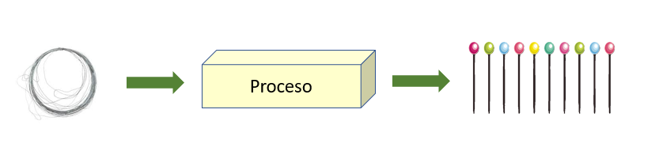
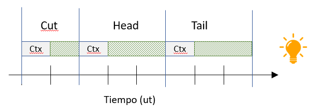
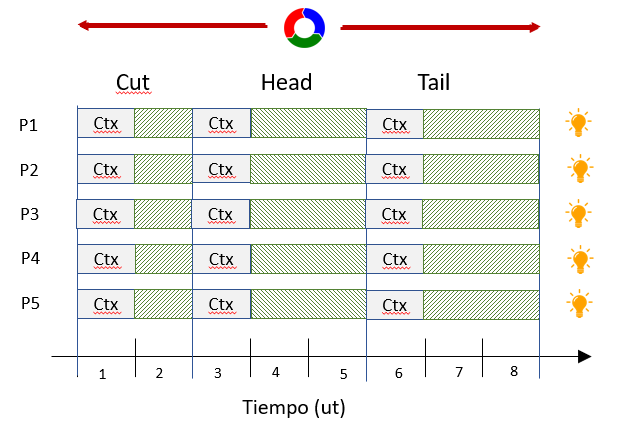
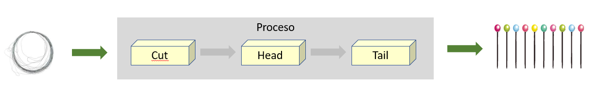
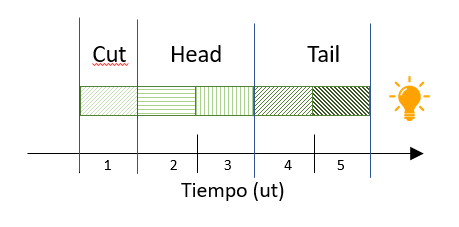
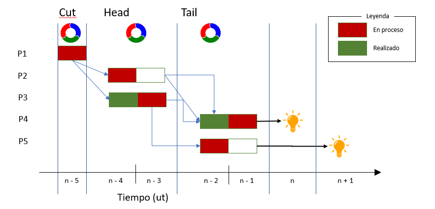
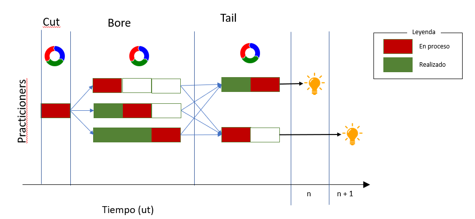

# Adam Smith {#sec-smith-division-trabajo}

Adam Smith fue un economista que publicó, entre otros, el famoso libro "La riqueza de las naciones" [@smith1776], el cual se considera como uno de los pilares de la economía moderna. 

Smith planteaba el supuesto de una empresa de fabricación de alfileres, la cual vamos a modelar de la siguiente manera:

1. Tenemos una empresa que fabrica alfileres
2. La empresa esta compuesta por 5 practicioners
3. Todos los practicioners están capacitados para realizar todas las tareas asociadas al negocio
4. El tiempo de trabajo se mide en Unidades de Trabajo -ut-, asignando 800 ut/dia
5. El coste (en Unidades Monetarias -um-), por simplicidad, lo asimilaremos a las ut con una relación 1-1; es decir,
consideramos despreciable el coste del insumo alambre con respecto al coste del insumo Mano de Obra.

Por otro lado, el proceso de fabricación consta de tres fases que se ejecutan en secuencia por cada practicioner:

1. Se corta un trozo de alambre de la medida adecuada
2. Se le pone una cabeza
3. Se ajusta la punta

Y por último:

A) Cada una de estas fases requiere una cierta cantidad de tiempo (medida en UTs)
B) Además hay que considerar que cada fase requiere de:
      1. Unas herramientas diferentes
      2. Un "enfoque mental" diferente
      
Esto último, el proceso de dejar unas herramientas, recoger otras, prepararse para la nueva tarea,
también consume tiempo, aunque no sea un proceso productivo. Es lo que llamamos "**cambio de contexto**";
un proceso o tarea implícito denominado "**coste oculto**", el cual coste suele ignorarse en los modelos.

Dicho esto, nuestro modelo es tan simple como este diagrama:

A partir de un rollo de alambre, realizamos un cierto proceso que genera un cierto valor añadido,
y obtenemos unos alfileres que son nuestro producto

### Paso 1: Identificación de procesos {.unlisted}

De acuerdo con la teoría de Smith, analizamos el proceso global e identificamos fases o subprocesos:

Ya tenemos nuestro proceso dividido en tres procesos secuenciales, también, aunque no sea muy 
intuitivo en el diagrama se han "autodefinido" los límites de cada uno:

| Proceso | Entrada | Salida |
|---------|---------|--------|
| Cut  | Rollo de alambre | Una pieza de alambre recta de cierta longitud |
| Head | Una pieza de alambre recta | La misma pieza con una cabeza redonda en una punta |
| Tail | Una pieza alambre con una cabeza en una punta | La misma pieza con la otra punta afilada | 

Esto, implícitamente, nos permite incrementar la calidad del producto identificando errores o disfunciones, por ejemplo:

- Cut: El alfiler es demasiado largo o corto
- Head: No tiene cabeza o esta mal
- Tail: No tiene punta

Y tenemos una secuencia de acciones definidas y documentadas:

| Seq. |Accion |
|------|-------|
| 1 | Practicioner se prepara para la fase de corte |
| 2 | Realiza el corte. Es una operación sencilla que consume 1 ut |
| 3 | Practicioner se prepara para poner la cabeza al alfiler |
| 4 | Inicia el proceso. Este consume 2 ut |
| 5 | Finaliza el proceso de la cabeza |
| 6 | Practicioner se prepara para preparar la punta |
| 7 | Inicia el proceso. Este consume 2 ut |
| 8 | Finaliza el proceso |
| 9 | Se ha creado un alfiler. Reinicia el proceso

Este proceso es el que realiza cada uno de de los practicioners de manera repetitiva a lo largo de su jornada.

De acuerdo con esto y los supuestos del ejemplo:

- Crear un único alfiler cuesta 8 ut.
- Como tenemos 5 practicioners trabajando "en paralelo", generamos 5 alfileres (outputs) cada 8 ut
- Si la jornada se divide en 800 ut.

$$
 \begin{aligned}
    prod_{ut} &= \frac{1\;item}{8\;ut} \: =\: 0.125 \: \frac{item}{ut} \\
    prod_{pract} &= Prod_{ut} *\: 800 \frac{ut}{dia} = 100 \frac{item}{pract} \\
    prod\:diaria_1 &= Prod\:practicioner * (5 \; pract.) = modulus ( \frac{500}{item})   \\
 \end{aligned}    
$$

    Capacidad_{dia} &= Prod_{pract} \: * \: \sum practicioner \: &= \: 100 \: * \: 5 \: = 500 \\
    Coste\:marginal &= \frac{1}{Proc_ut} \: =\: 8

**Pros and Cons**

Este proceso se aplica para cada uno de los practicioners de la empresa: 5

### Paso 2: División de procesos (Especialización) {.unlisted}

Siguiendo su teoría, separamos los procesos, además, como se ha mencionado, tenemos perfectamente 
delimitados los límites de cada uno:

Las fases del proceso pasaban a verse simbolicamente de la siguiente manera:

Como se puede observar el ciclo ha pasado de costar 8 ut. a 5 ut. Pero resulta mas ilustrativo si mostramos el trabajo conjunto en función del tiempo:

1. El número de practicioners no ha cambiado, luego mi organización es la misma
2. Ya no existe un único ciclo, si no tres ciclos diferentes
3. A partir de un determinado instante de tiempo ($ut = n_i$), al que llamaremos período de arranque:
   a. Cada practicioner esta realizando alguna tarea; es decir, no hay períodos de inactividad
   b. Cada $ut > n_i$ se genera un nuevo producto

Respecto a las fases del proceso:

A) **Cut**: Genera un trozo de alambre cada ut
B) **Head**: Al tener dos particioners, se genera un _output_ cada ut
C) **Tail**: Sigue necesitando dos ut por alfiler, pero dado el paralelismo de tareas, se genera un producto/output cada ut de manera alternativa

Es decir:

$$
\begin{aligned}
\forall j > i \; \big| \; i &= periodo\_arranque \\
Coste_{cut} &= 1 \\
Coste_{head} &= 2 \\
Coste_{tail} &= 2 \\
Prod_{ut} &= 1 \cdot \frac{item}{ut} \\
Prod\_diaria_2 &= Prod\_unitaria \cdot 800\,ut = 800\,item \\
Prod_{ut} &= 1 \cdot \frac{item}{ut} \\
Capacidad_{dia} &= Prod_{ut} \cdot \sum ut_{dia} - periodo\_arranque \approx 800 \\
Coste\_marginal &= \sum coste_i = 5
\end{aligned}
$$

Y las variaciones respecto al proceso original:

$$
\begin{aligned}
\Delta Capacidad
    &= \left(\frac{Capacidad_2}{Capacidad_1} - 1\right) \cdot 100
    = 60\% \\
\Delta Productividad
    &= \left(\frac{Prod\_diaria_2}{Prod\_diaria_1} - 1\right) \cdot 100
    = 60\% \\
\Delta Coste\_marginal
    &= \left(1 - \frac{Coste\_marginal_2}{Coste\_marginal_1}\right) \cdot 100
    = 37.5\%
\end{aligned}
$$

Es decir, sin modificar mi estructura organizativa, ni realizar cambios "significativos": 
Seguimos siendo los mismos en cantidad y calidad:

a) Hemos incrementado la **capacidad** de la empresa en un **30%**; fabricamos un 30% mas de productos
b) Hemos incrementado la **productividad** de los practicioners un **60%**, sin modificar sus trabajos
c) Hemos reducido el coste marginal (incrementado el beneficio que nos llevamos por cada item) en un **37.5%**

### Paso 3: Diversificacion y reutilización {.unlisted}

Siguiendo con nuestro ejemplo, supongamos ahora que la empresa quiere fabricar agujas hipodérmicas en lugar de alfileres.
El proceso sería:

1. Cut: Cortar el acero a la longitud deseada
2. Bore: Hacer el agujero dentro del acero
3. Tail: Crear la punta de la aguja

Si analizamos los procesos anteriores:

- Cut: El proceso es similar, unicamente cambiaremos la longitud del alambre
- Tail: Tambien es similar, crear una punta afilada

El único proceso que cambia es _Head_ por _Bore_, ahora necesitamos realizar una tarea diferente y mas complicada.
Asumiremos que el coste de esa fase es 3 ut.

Formamos a los practicioners de esa fase, o adquirimos otra máquina (los practicioners tienen que seguir siendo formados),
y obtenemos el siguiente flujo del proceso:

Notese que hemos incluido un nuevo practicioner en la fase _bore_ para adecuar los tiempos y evitar
cuellos de botella.

- Al igual que antes, se genera un producto/output por cada ut, manteniendo la capacidad productiva en 800.
- Unicamente he contratado un nuevo practicioner y formado a otros dos, el resto de la empresa no ha cambiado

Ahora, sin embargo, somos capaces de fabricar dos productos diferentes en función de la demanda.

| Proceso | Entrada | Salida |
|---------|---------|--------|
| Cut  | Rollo de alambre | Una pieza de alambre recta de cierta longitud |
| Head | Una pieza de alambre recta | La misma pieza con una cabeza redonda en una punta |
| Tail | Una pieza alambre con una cabeza en una punta | La misma pieza con la otra punta afilada | 

su teoría, separamos los procesos, además, como se ha mencionado, tenemos perfectamente 
delimitados los límites de cada uno:

