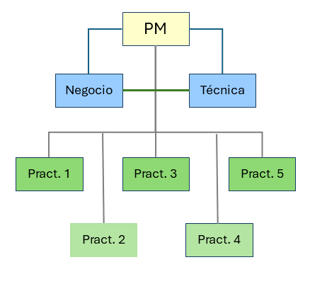
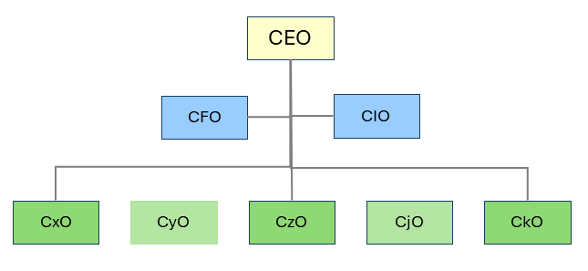

A nosotros nos gusta decir que toda organización es, en esencia, un fractal. Para aquellos no muy puestos en matemáticas, y de manera informal, podemos decir que un fractal presenta **autosimilitud**, que es la propiedad por la que, independientemente del nivel de detalle que se use, la estructura es similar; dicho de otro modo, que siempre presenta un patrón similar, que no implica igual.

Los fractales se suelen asociar a la denominada *matemática del caos*, pero tienen mucho de estructura y organización. Cambios muy pequeños en la estructura pueden tener un impacto muy grande en la globalidad (Para una explicación más detallada de la autosimilitud y la geometría fractal, véase @sec-fractales.)

## El patrón organizativo

Antes de explicar el patrón básico damos por asumido los siguientes axiomas económicos

- La economía es la ciencia social que estudia cómo satisfacer necesidades potencialmente ilimitadas mediante recursos escasos.
- El objetivo de una organización es maximizar el beneficio/utilidad de la misma
- La organización estructura, distribuye y coordina esos recursos para alcanzar sus objetivos.

Una estructura organizativa típica de cualquier proyecto informático podría ser como se muestra en la siguiente figura:

Si seguimos subiendo en la organización, volvemos a encontrarnos básicamente con el mismo patrón, aunque cambien los nombres:

- CEO: *Chief Executive Officer*.
- CFO: *Chief Financial Officer*, responsable de gestionar los recursos económicos que permiten el negocio.
- CIO: *Chief Information Officer*, responsable de las capacidades tecnológicas que permiten el negocio.
- CxO: responsables de otras áreas productivas y no productivas necesarias para la organización.

La idea que nos interesa no es que todas las organizaciones tengan exactamente esta forma, sino que determinadas funciones y responsabilidades reaparecen en distintos niveles de la estructura, por lo que podemos asegurar que:

_Una organización no se define únicamente por la forma concreta de su organigrama. Al cambiar de escala o de estructura, determinadas funciones y responsabilidades vuelven a aparecer bajo nombres, agrupaciones o niveles diferentes._

