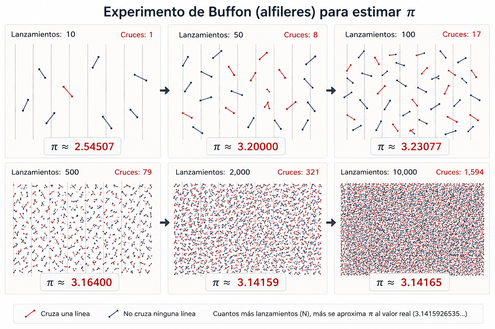

## Determinismo, probabilidad y reproducibilidad

La ciencia y la ingeniería se apoyan en una idea fundamental: **la reproducibilidad**.

Cuando observamos un fenómeno, formulamos una hipótesis o diseñamos un experimento, esperamos que otras personas puedan repetirlo bajo las mismas condiciones y obtener resultados compatibles. La reproducibilidad es una de las formas fundamentales de distinguir un resultado verificable de una observación aislada.

Pero **reproducibilidad no significa necesariamente obtener siempre el mismo resultado**.

En muchas disciplinas científicas esto es evidente.

En física podemos estudiar fenómenos cuyo comportamiento es esencialmente determinista. En estadística, biología, meteorología, mecánica cuántica o teoría de probabilidades trabajamos habitualmente con fenómenos en los que la variabilidad forma parte del propio objeto de estudio.

Ambos pueden estudiarse científicamente, lo que cambia es **qué esperamos reproducir**.

En un proceso **determinista**, conocidas las condiciones iniciales y las reglas que gobiernan el proceso, unas mismas condiciones y unas mismas entradas conducen al **mismo resultado**. Si repetimos el proceso en las mismas condiciones, esperamos reproducir el **mismo resultado**.

En un proceso **probabilístico**, por el contrario, mantener las mismas condiciones y las mismas entradas no garantiza obtener el **mismo resultado** en cada ejecución. Distintas ejecuciones pueden producir resultados diferentes y, dependiendo del proceso, es perfectamente esperable que no obtengamos el **mismo resultado**.

Esto no significa que el proceso carezca de reglas, precisamente al contrario: lo que puede ser perfectamente reproducible es **su comportamiento probabilístico**.

Al lanzar una moneda equilibrada no podemos predecir si el siguiente lanzamiento será cara o cruz. Sin embargo, si realizamos un número suficientemente grande de lanzamientos, esperamos que la proporción de ambos resultados se aproxime al comportamiento previsto.

Cada ejecución concreta puede ser diferente, pero el fenómeno sigue siendo reproducible. La diferencia fundamental está, por tanto, en dónde situamos nuestra expectativa de reproducibilidad:

- En un proceso determinista esperamos reproducir **el mismo resultado**.

- En un proceso probabilístico esperamos reproducir **las propiedades del proceso y de la distribución de sus resultados**, precisamente porque cada ejecución, aun partiendo de las mismas condiciones y las mismas entradas, puede no producir el **mismo resultado**.

Lo que debe mantenerse es su comportamiento: las probabilidades asociadas a los distintos resultados, su distribución, sus límites o las propiedades que hayamos definido para considerarlo válido, en ambos casos existe rigor: **Lo que cambia es qué debe reproducirse.**

## Sistemas de Información

La mayoría de los Sistemas de Información que diseñamos son, en esencia, **deterministas y reproducibles**.

Dadas unas mismas condiciones, unas mismas entradas y unas mismas acciones, esperamos obtener siempre el **mismo resultado**, esta propiedad es precisamente una de las que hacen posible la automatización.

Cuando automatizamos un proceso estamos sustituyendo, total o parcialmente, una actividad que antes debía realizar una persona por un sistema capaz de ejecutar unas reglas previamente definidas. Para poder hacerlo necesitamos confiar en que, ante las mismas condiciones, el sistema producirá el **mismo resultado**, independientemente de cuándo, donde, o quien lo ejecute, de cuántas veces se repita o de quién haya construido correctamente su implementación.

Una transferencia bancaria, el cálculo de una nómina, la aplicación de una regla fiscal, la ejecución de una consulta o un algoritmo de ordenación pueden ser enormemente complejos internamente, pero esperamos de ellos ese comportamiento: las mismas entradas y las mismas reglas deben producir el **mismo resultado**.

Sobre este principio hemos construido buena parte de la ingeniería de software: especificaciones, algoritmos, pruebas, validaciones y automatización de procesos.

Pero esto no significa que la informática haya sido exclusivamente determinista, los métodos probabilísticos forman parte de la computación prácticamente desde sus orígenes. Mucho antes de la aparición de los actuales Sistemas Inteligentes ya utilizábamos probabilidad, estadística y aleatoriedad para resolver problemas que resultaban difíciles, costosos o incluso impracticables mediante procedimientos puramente deterministas.

- Los **métodos de Monte Carlo**, desarrollados durante los primeros años de la computación electrónica, utilizan muestreo aleatorio y repetición para aproximar soluciones numéricas. En lugar de calcular directamente una solución mediante una secuencia completamente determinada de operaciones, realizan numerosas ejecuciones cuyos valores individuales pueden variar y obtienen conocimiento a partir de su comportamiento conjunto.

- Las **cadenas de Markov** permiten representar procesos en los que el siguiente estado no queda determinado de forma única, sino mediante probabilidades asociadas a los posibles estados siguientes. Sus fundamentos matemáticos son anteriores incluso a los ordenadores y posteriormente encontraron aplicaciones en simulación, comunicaciones, reconocimiento, predicción y numerosos problemas computacionales.

- La **inferencia bayesiana** permite actualizar la probabilidad de una hipótesis a medida que aparece nueva evidencia. También se incorporó a sistemas informáticos para trabajar con información incompleta o incierta, sustituyendo la certeza absoluta por grados de probabilidad.

- Los **sistemas expertos** incorporaron igualmente mecanismos para representar incertidumbre. No siempre era posible establecer simplemente que una afirmación fuese verdadera o falsa: podían existir factores de certeza, probabilidades o evidencias parciales sobre las que el sistema debía razonar.

Con el tiempo aparecieron también **lenguajes y modelos de programación probabilística**, en los que las distribuciones de probabilidad no son únicamente una herramienta matemática utilizada por un algoritmo, sino parte explícita del propio modelo computacional, por tanto, la computación probabilística no aparece con la actual Inteligencia Artificial, llevamos décadas construyendo sistemas que utilizan el azar, la probabilidad y la incertidumbre de manera deliberada y rigurosa.

La diferencia está en que, tradicionalmente, estos elementos probabilísticos se encontraban **dentro de sistemas cuyo proceso de construcción seguía siendo esencialmente determinista**.

## El número π

Todo el mundo conoce el número π. Es una de las constantes fundamentales de las matemáticas y probablemente una de las pocas que forman parte de la cultura general. Aparece en geometría, física, ingeniería y, naturalmente, en informática. La mayoría de los lenguajes y bibliotecas de programación proporcionan incluso una representación de π como constante predefinida.

π es un número **irracional y trascendente**, cuyo valor está completamente determinado aunque su representación decimal sea infinita, pero no existe incertidumbre alguna acerca de cuál es su valor.

Al ser irracional, su representación decimal contiene infinitos dígitos y no presenta una secuencia periódica. Esto significa que nunca podemos escribirlo completamente ni almacenarlo completamente en un ordenador, no existe un último decimal de π.

Lo que hacemos, por tanto, es calcular **aproximaciones** de π con la precisión que necesitamos.

``` text
3,14
3,14159
3,141592653589793
```

Todas ellas representan el mismo número, pero con diferentes niveles de precisión.

A lo largo de la historia se han desarrollado numerosos métodos para calcular cada vez más cifras de π y, con la aparición de los ordenadores, se han dedicado enormes recursos computacionales a ampliar esa precisión. Existen algoritmos extremadamente eficientes. El algoritmo de **Chudnovsky**, por ejemplo, permite obtener aproximadamente catorce nuevos dígitos correctos de π por término y constituye la base de muchos cálculos de π a gran escala.

Pero hay una característica especialmente interesante para nuestro propósito: El valor que buscamos está completamente determinado, mientras que **el procedimiento que utilizamos para aproximarnos a él no tiene por qué ser determinista**.

### Los números primos

Algo parecido ocurre en otro terreno fundamental de las matemáticas y de la informática: los números primos, sabemos perfectamente qué significa que un número sea primo. Para cualquier número concreto existe una respuesta determinada: **es primo o no lo es**.

Disponemos de métodos deterministas para comprobar la primalidad. Sin embargo, algunos de los algoritmos más utilizados en la práctica para trabajar con números grandes son probabilísticos, porque permiten obtener respuestas con enorme rapidez y con una probabilidad de error que puede reducirse tanto como sea necesario mediante sucesivas comprobaciones.

**Miller-Rabin** es uno de los ejemplos más conocidos. De nuevo aparece la misma idea: podemos utilizar deliberadamente un procedimiento probabilístico para responder a una pregunta cuya respuesta está completamente determinada, la dificultad más profunda no está en definir qué es un número primo, sino en comprender cómo se distribuyen los números primos entre los números naturales.

Esa distribución está relacionada con uno de los grandes problemas todavía abiertos de las matemáticas: la **hipótesis de Riemann** y el comportamiento de la función Zeta de Riemann.

### El experimento de Buffon

En el siglo XVIII, Georges-Louis Leclerc, conde de Buffon, planteó un experimento extraordinariamente sencillo:

- Se dibujan líneas paralelas separadas regularmente sobre una superficie y se lanzan alfileres al azar.

- Algunos alfileres cruzarán alguna de las líneas.

- Otros no.

Si conocemos la longitud de los alfileres, la separación entre las líneas, el número total de lanzamientos y cuántos alfileres han cruzado una línea, podemos utilizar la proporción obtenida para **estimar π**.

{fig-alt="Experimento de Buffon para estimar pi mediante el lanzamiento aleatorio de alfileres sobre líneas paralelas."}

El resultado de cada lanzamiento es aleatorio, dos personas pueden realizar el mismo experimento, con los mismos alfileres, las mismas líneas y el mismo número de lanzamientos, y obtener resultados diferentes, incluso la misma persona puede repetir inmediatamente el experimento y obtener otro valor.

Una ejecución puede producir:

``` text
π ≈ 3,08
```

otra:

``` text
π ≈ 3,19
```

y otra:

``` text
π ≈ 3,13
```

Ninguna de esas ejecuciones reproduce necesariamente el **mismo resultado**.

Sin embargo, cuando aumentamos el número de lanzamientos, las estimaciones tienden a aproximarse al valor de π.

{fig-alt="Estimaciones sucesivas de pi mediante el experimento de Buffon a medida que aumenta el número de lanzamientos."}

El azar no impide obtener conocimiento, forma parte del procedimiento utilizado para obtenerlo, y aquí aparece una diferencia fundamental respecto a nuestra intuición habitual sobre los algoritmos:

> **Podemos utilizar un proceso probabilístico para aproximarnos a un valor completamente determinado.**

### ¿Qué algoritmo es mejor?

Supongamos ahora que necesitamos calcular π, podemos utilizar un algoritmo determinista extremadamente eficiente, como Chudnovsky. También podemos lanzar puntos aleatoriamente sobre un cuadrado y un círculo, utilizar el experimento de Buffon o recurrir a otros métodos de Monte Carlo para obtener una estimación, desde el punto de vista de la precisión, la comparación parece absurda.

Chudnovsky converge extraordinariamente rápido, Monte Carlo converge lentamente y, además, distintas ejecuciones pueden no producir el **mismo resultado**, pero eso no significa que el segundo algoritmo sea incorrecto, significa que tenemos que preguntar algo diferente:

> **¿Qué precisión necesita el problema?**

Si una aplicación solo necesita π con tres decimales, un procedimiento probabilístico que proporcione esa precisión con suficiente confianza puede ser perfectamente válido, si necesitamos mucha más precisión, ese mismo procedimiento puede ser completamente inadecuado.

NASA/JPL, por ejemplo, utiliza `3.141592653589793` para cálculos de navegación interplanetaria de máxima precisión. Unas quince cifras decimales proporcionan ya una precisión muy superior a la necesaria incluso a escalas astronómicas, por tanto, un algoritmo no puede evaluarse únicamente preguntando si reproduce exactamente el valor matemático ideal, tenemos que conocer **los requisitos del problema**.

La pregunta deja de ser únicamente:

> **¿Produce el mismo resultado?**

Y pasa a incluir:

> **¿Produce un resultado suficientemente preciso, con una probabilidad suficientemente alta y con un coste adecuado para el problema que queremos resolver?**

El valor matemático continúa estando completamente determinado, lo que hemos cambiado es **el procedimiento utilizado para llegar hasta él**.

## Sistemas Inteligentes generativos

Hasta ahora hemos hablado de sistemas que pueden incorporar métodos probabilísticos en su funcionamiento, pero cuyo **proceso de construcción sigue siendo esencialmente determinista**.

Podemos diseñar un algoritmo de Monte Carlo, implementar una cadena de Markov o utilizar Miller-Rabin. El comportamiento de alguna parte del sistema puede ser probabilístico, pero los ingenieros siguen definiendo de forma determinista el algoritmo, su estructura, sus reglas, sus entradas, sus límites y los criterios con los que se valida.

El código fuente que implementa el algoritmo es el mismo cada vez que se ejecuta.

La probabilidad está **dentro del sistema que hemos construido**.

Con los Sistemas Inteligentes generativos aparece una diferencia fundamental:

> **La probabilidad entra también en el proceso de construcción del sistema.**

Podemos proporcionar las mismas instrucciones, el mismo contexto, los mismos requisitos y las mismas restricciones a un Sistema Inteligente generativo y no obtener necesariamente la **misma solución**.

Una ejecución puede proponer una determinada estructura.

Otra puede organizar los componentes de manera diferente.

Otra puede elegir una estrategia distinta.

Otra puede interpretar de forma diferente algún aspecto intermedio del problema y llegar, por otro camino, a una solución igualmente válida.

Incluso cuando todas ellas satisfacen correctamente los mismos requisitos, no existe necesariamente una única materialización posible ni podemos esperar que sucesivas ejecuciones produzcan el **mismo resultado**.

Esto introduce una diferencia profunda respecto al proceso de ingeniería al que estamos acostumbrados.

En la ingeniería de software tradicional podemos admitir que dos programadores escriban código diferente para resolver un mismo problema, pero una vez construida y fijada una implementación, esperamos que esa implementación permanezca estable y que, ante las mismas entradas y condiciones, produzca el **mismo resultado**.

Con un Sistema Inteligente generativo, la variabilidad puede aparecer **antes de que exista siquiera esa implementación**.

Ya no afecta únicamente a la ejecución de un algoritmo probabilístico.

Puede afectar a la forma en que se interpreta el problema, se propone una solución, se estructura el sistema, se seleccionan determinadas alternativas y finalmente se materializa el artefacto que vamos a ejecutar.

Por tanto, aparecen dos niveles diferentes de variabilidad:

1. **Variabilidad en la ejecución**, cuando un sistema ya construido incorpora comportamiento probabilístico.

2. **Variabilidad en la construcción**, cuando el propio proceso utilizado para producir el sistema puede generar materializaciones diferentes a partir de las mismas entradas.

La segunda es especialmente relevante para la ingeniería aumentada con Sistemas Inteligentes.

Porque si no podemos exigir que una nueva ejecución del proceso de construcción produzca exactamente el **mismo resultado**, la reproducibilidad ya no puede depender exclusivamente de reproducir el artefacto generado.

Tenemos que desplazar nuevamente la pregunta:

> **¿Qué es exactamente lo que necesitamos reproducir?**

```{=html}
<!--
TODO:
- Revisar y añadir fuentes formales para Monte Carlo, Markov, Bayes, Miller-Rabin, Riemann y Chudnovsky.
- Añadir referencia JPL/NASA sobre las cifras de pi necesarias en navegación interplanetaria.
- Decidir si se mantiene la imagen alternativa buffon-convergencia-alt.png.
- Siguiente apartado: conclusión y método. Qué significa reproducibilidad cuando el propio proceso de construcción puede producir soluciones diferentes.
-->
```
